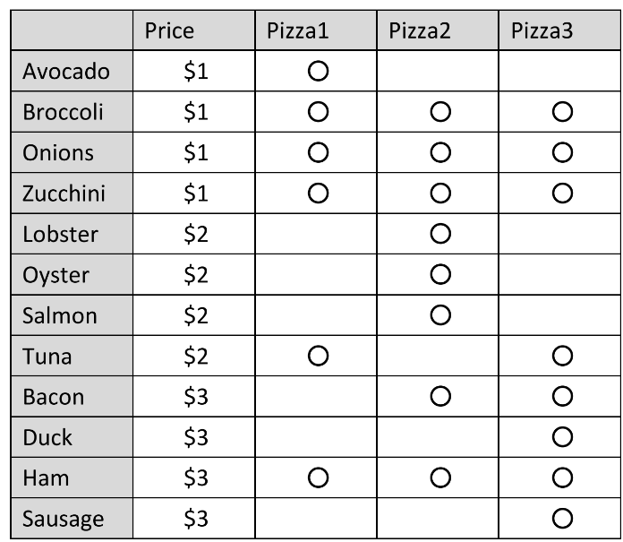
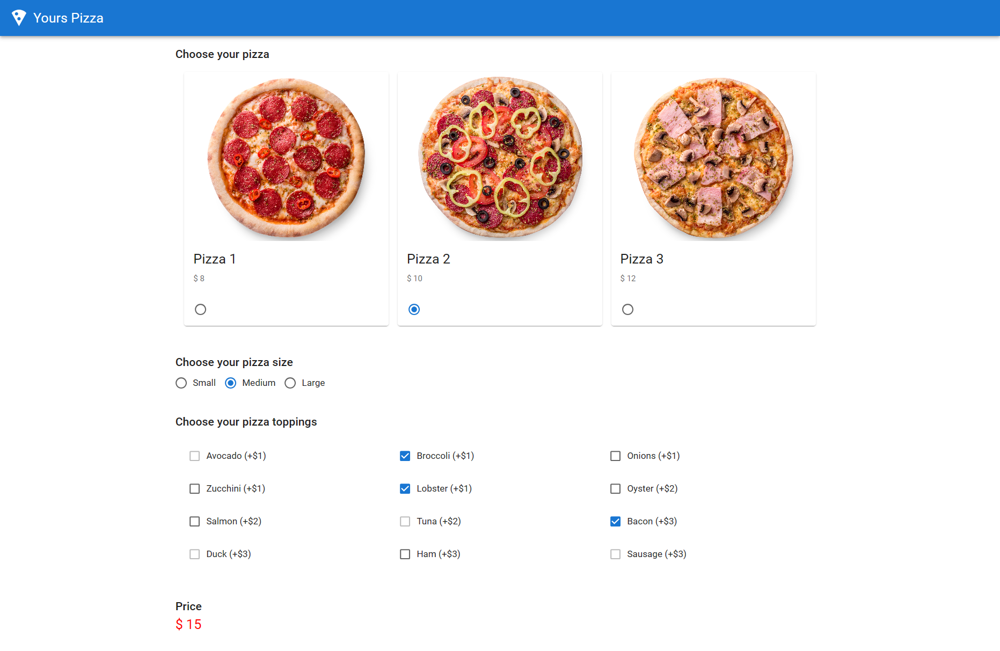
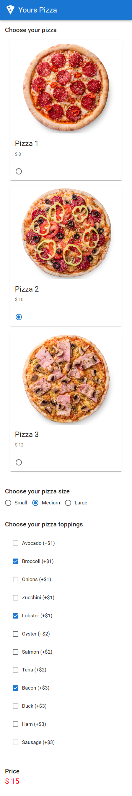

# Employment Examination Pizza Store

## Requirements 📖

- Make a website using React and Material UI component of a Pizza Store.
- The Pizza Store have 3 block, Pizza Card, Pizza Size and Pizza Toppings.
- Default size is medium. You must use “Radio Buttons” for Pizza and Size. As toppings, you must use “Checkboxes”.
- If the Pizza is chosen, you must show price in below space. As toppings,
  selectable topping varies depending on the pizza.
- If you chose(or change) size, you must change the price in below space.
  As “Size”, If chose “Large”, add $2 to the price. If chose “Small”, reduce $1
  to price.
- If you chose some ”Toppings”, you must change the “Price” in below space.
- If you change the “Pizza”, you must change enable / disable about
  “Topping”. And then you must obey previous page about selectable
  “Topping”.

- Toppings
  
  

## Screenshots 🌄

### Full screen

### Mobile screen

